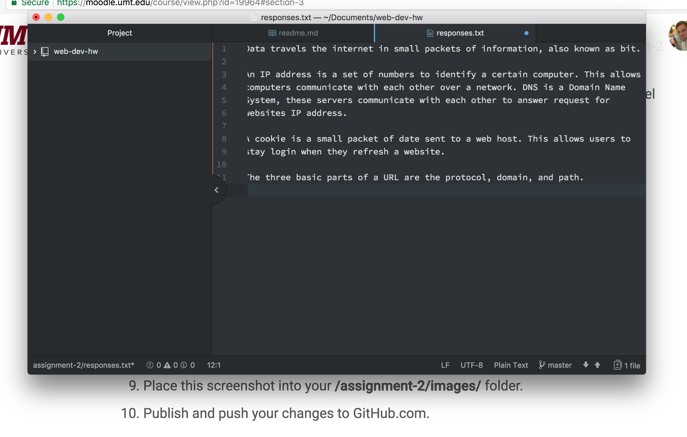

## Assignment 2

A version control system as a system where you can make multiple saves and go back to different points in your history.  This is beneficial for this class because let’s say you’re working on a website and put in a blue background.  But then change it to a red background. Later on, if you change your mind and want to go back to the blue background you can access that revision.  The version control system that we are using in this class, is GitHub.

Here is my [ responses](./responses.txt).

My work cycle this week was really fun.  I enjoyed spending my time learning about URLs and how the internet is designed. I’m still trying to figure out the markdown language but I’m slowly getting it. Other than a few quick Google searches for the markdown cheat sheet, I really didn’t have any problems. There is really nothing else I would like to discuss I just want to jump right into the next lesson.

