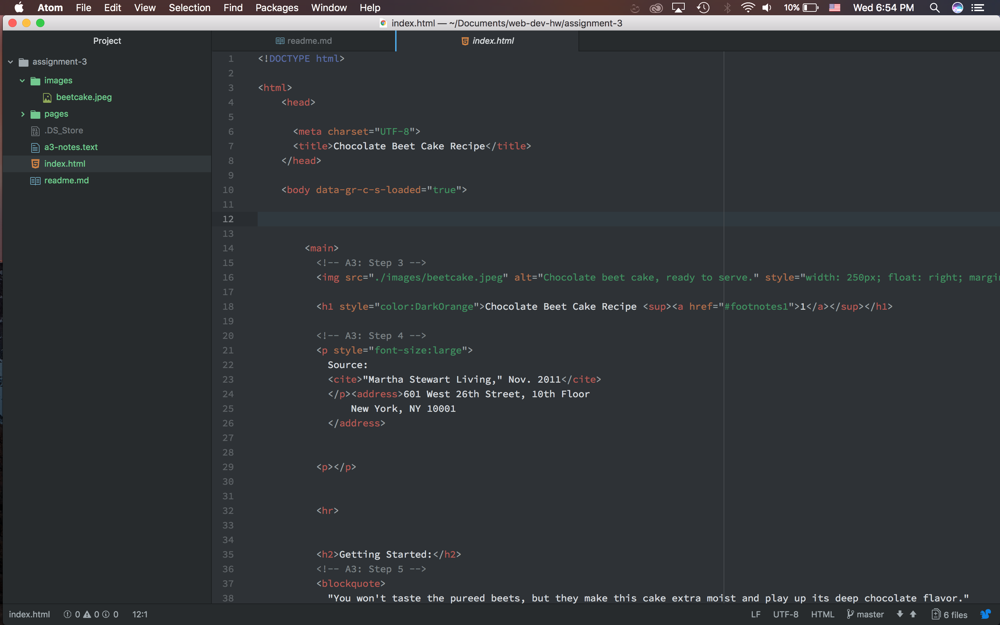

# Assinement 2

This typical only have one body and heading on one page. The heading contains all the meta-data the title and the scripts used in the document. The body contains the document, the text, and images displayed on the website.

Structural Markup uses information about the structure of the document.  An example would be heading paragraphs and line breaks.

Semantic markup uses information to described the meaning of a word or information. And example of this would be bolding and italicize.

This week seem like a lot of information was thrown at us, and I spent a majority of my time reading out of the book. I didn’t have any issue when it came to working on the website.  I’m still confused for some parts but I believe I was able to get them worked out on my website. One thing that really concerns me is knowing when to use the different syntaxes. I feel like there’s going to be a lot more challenges going forward.

