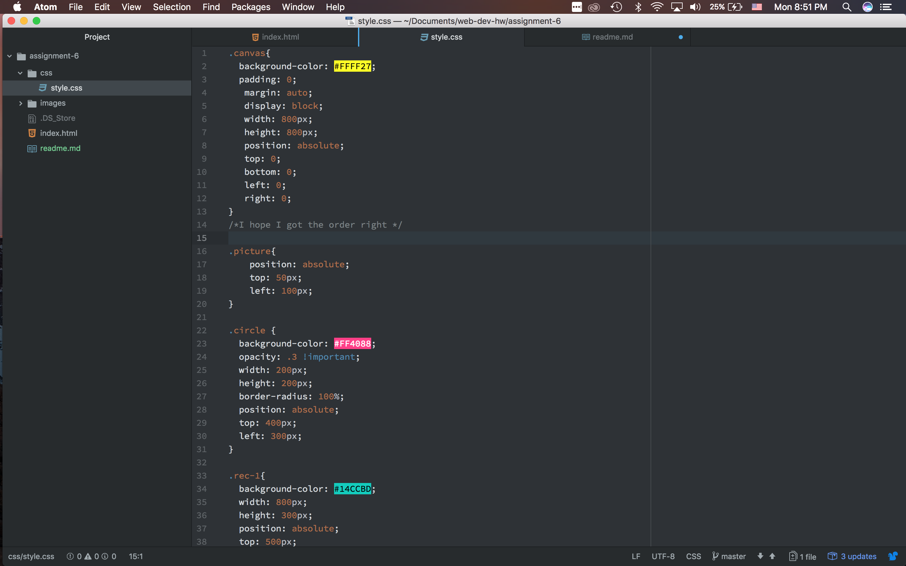

# Readme Assignment 6

I chose the sun graphic from the 90s.  I thought it looked really good and I wanted to build kind of sunset on the beach with it. So I added simple rectangles for the land and water. I also, made the background yellow and I think it turned out well.

The colors I choose:
	- Yellow: FFFF27
	- Blue: 14CCBD
	- Green: 00FF5A
	- Pink: FF4088
	- Purple: CC14B5

So started this project with the goal of a sunset in mind. The 90s have a feel of bright neon colors to me so that’s what I ended up going with.  I went to Adobe Color and check out some the 90 presets they had. I also had to Google how to make a circle for the sun and it’s a lot more complicating than rectangles.  Overall, I think my work turned out well and I can’t wait to keep moving forward.

