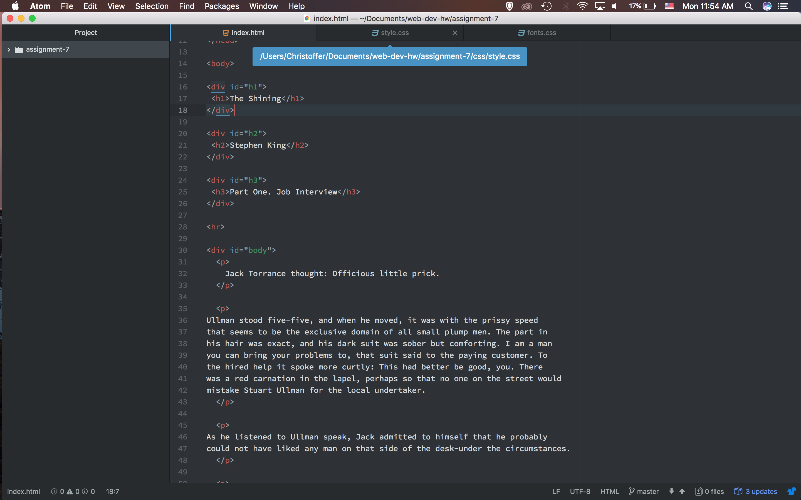

## Typography

My article was about Stephen King, so I chose to do more creepier fonts like Lakki Reddy, Ravi Prakash, and Overlock SC. I add a cursive to these fonts, made them red and designed it to be creepy.

System fonts are on your computer while web fonts are designed to be on the web, and website funds are designed to be seen by everyone on its kind of like default font. It is important to have fallback fonts because sometimes fonts won’t work on another system.

This work cycle with very different than most. I had trouble with the importing of fonts but at the end of able to get it to work. I learned a lot about fonts and how they work with the web.  I’m excited to move forward and keep working on CSS  styling.

