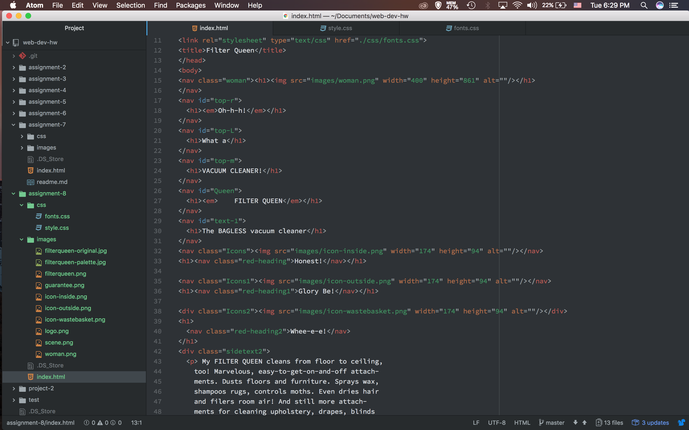

# Assignment 8

Padding is the area around an object. Margins are the area around the page.  Borders are the area around the text.

The most difficult think about this assignment for me was creating the layout for the design.  I understand how to bring layers in front.  But getting them just right so that they looked like the ad was difficult.

This week I spent a majority of my time figuring out how to get the layout just right. I also didn’t organize my code very well. Everything seemed to be a mess but it all worked out.  I learned a lot about CSS and how it works. I liked everything about this project and I can’t wait to move forward in web design.

