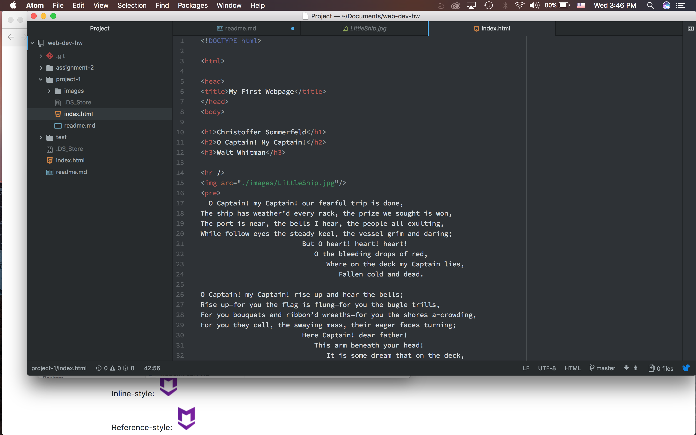

# Project 1 Readme

1. Google Chome

Google Chrome is one of the most used browsers and the only browser I use, even on my iphone.  I like the feature that allows plug-ins for it.  One plug-in that I use the most is grammary; it helps correct my grammar before I submit homework.

Visited Google back in the year 2000 with the Wayback Machine. That hasn’t changed very much but it seems like the site was designed for smaller screens. Also, a feature that I thought was cool, Google on the homepage was offering jobs. Clicking on it opened a link to all sorts of open positions. Not much has changed for the site it looks a little bit nicer now but it still has the same format for searching.

This week’s work cycle was interesting and fun. It was pretty need to be able to make a website within the first three weeks of the semester. I spent majority of the time trying to figure out the HTML language, I’m still not very confident in it.  Was able to complete almost everything within 6 hours. I’m very eager to continue learning HTML, and I can’t wait to put in background graphics and video.

