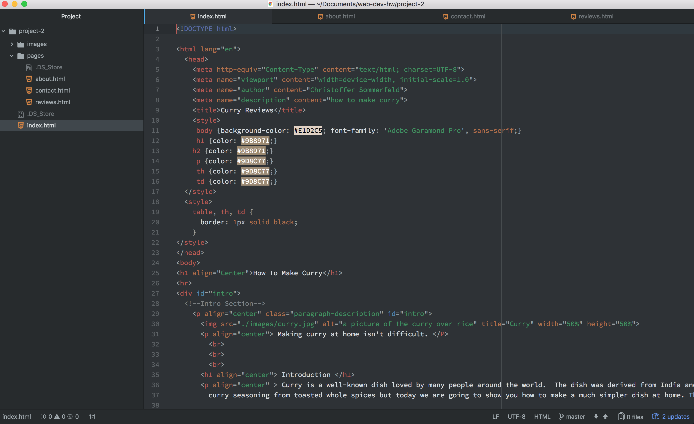

# Readme Project 2

B.) HTML has been very fun to learn so far. I’m still having trouble understanding the div and class tags. But after this last project, it has gotten easier to understand.

C.) Styling and CSS sounds like it’s going to be a lot of fun to learn. I enjoy learning more about the aesthetic part of a website, more than the content. I believe it’s going to be very fun, however, it’s probably going to be very difficult.

D.) This week was kind of rough I had trouble with the stylizing a bit. I didn't know what content I wanted to have or how it should look. I went to adobe color and found a background color and style I liked. Putting it together wasn't very hard. I was jumping around too much so I was losing track of what I was doing sometimes. In the end, everything came together and I’m proud of how it turned out. I can’t wait for next week and learning styling and CSS.

